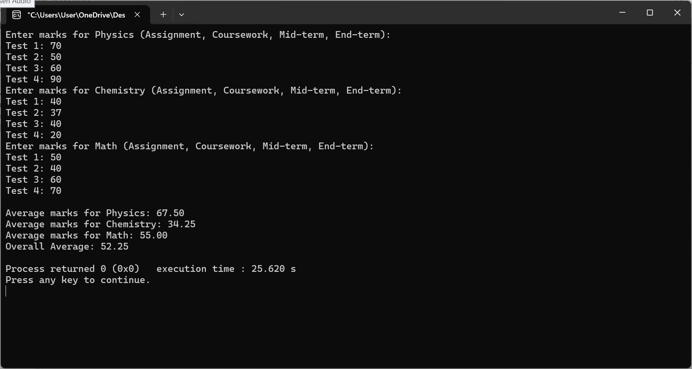

# Introduction to Programming

This repository contains C programs for two different tasks:

1. **Average Marks Calculation**: This program calculates the average marks of a student in three subjects: Physics, Chemistry, and Math. For each subject, four different tests are conducted: Assignment, Coursework, Mid-term, and End-of-term exams.

2. **Animals Grouping**: This program accepts two groups of animals: domestic animals and wild animals. After entering each group, the program prints the combined list of all animals.

## Table of Contents
- [Prerequisites](#prerequisites)
- [Usage](#usage)
- [Programs](#programs)
- [License](#license)

## Prerequisites

To run these programs, you need the following:
- A C compiler (such as GCC) installed on your system.
- Basic understanding of C programming concepts.

## Usage

### 1. Average Marks Calculation

This program takes input for marks from four tests (Assignment, Coursework, Mid-term, and End-of-term) for three subjects: Physics, Chemistry, and Math. It then calculates the average score for each subject and displays the overall average score.

### 2. Animals Grouping

This program allows the user to enter two groups of animals:
- **N domestic animals**
- **X wild animals**

The program will output the combined list of domestic and wild animals.

## Programs

### Average Marks Calculation Program
- **File**: `average_marks.c`
- **Description**: This C program calculates the average marks for three subjects.
- **Input**: Marks for each test in the four categories (Assignment, Coursework, Mid-term, and End-of-term) for Physics, Chemistry, and Math.
- **Output**: Average marks for each subject and the overall average.
- # Introduction to Programming

This repository contains C programs for two different tasks:

1. **Average Marks Calculation**
2. **Animals Grouping**

## Screenshots

### 1. Average Marks Calculation Program

### 2. Animals Grouping Program

### Animals Grouping Program
- **File**: `animals_grouping.c`
- **Description**: This C program takes input for N domestic animals and X wild animals and then prints the combined list.
- **Input**: List of N domestic animals and X wild animals.
- **Output**: Combined list of animals.

